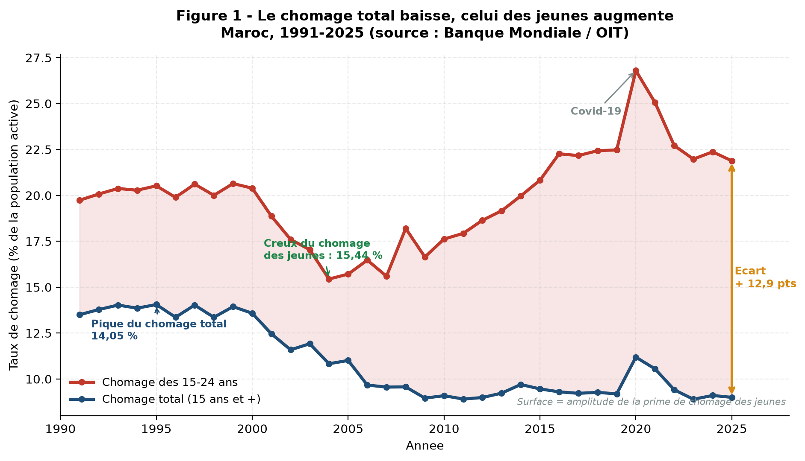
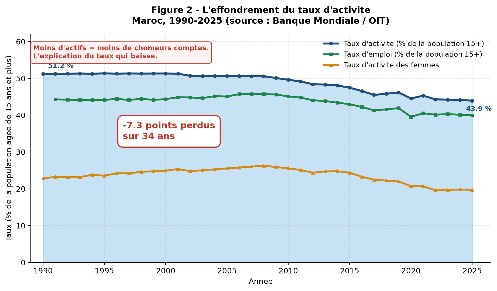
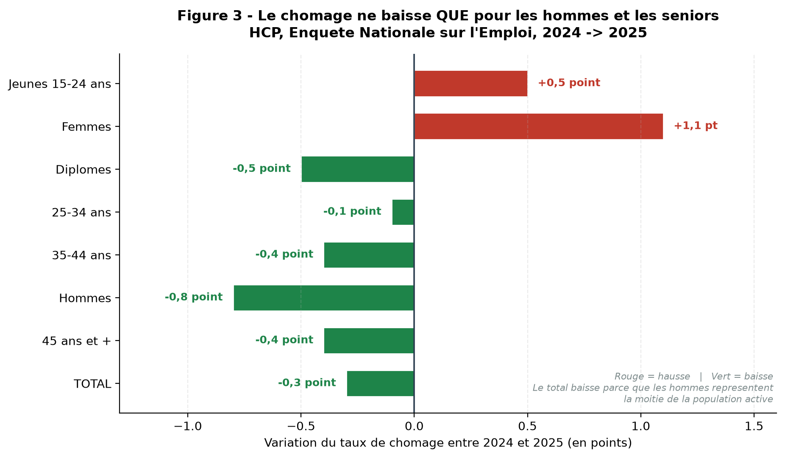
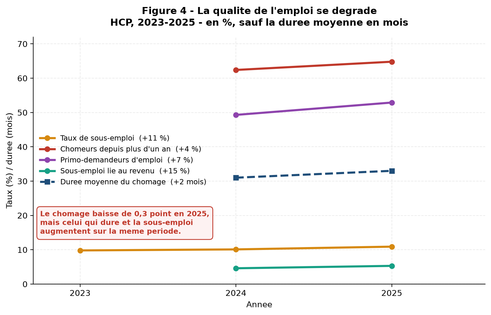

# Pourquoi le taux de chômage augmente sans cesse au Maroc ?

**Question 3 — Analyse de données**

**Auteur :** Bassema El Haili
**Date :** octobre 2026
**Sources :** Banque Mondiale / OIT (série 1991-2025) · Haut-Commissariat au Plan, Enquête Nationale sur l'Emploi (2023-2025)

---

## 0. Le résultat principal, en une phrase

**La prémisse de la question n'est pas confirmée par les données : le taux de chômage total marocain ne monte pas sans cesse, il a *baissé* de 4,5 points entre 1991 et 2025.** Ce qui augmente sans cesse, c'est le chômage des **jeunes** et des **femmes** — et cette baisse du total s'explique en grande partie par un mécanisme inquiétant : **les Marocains sortent du marché du travail plutôt que de trouver un emploi.**

---

## 1. Introduction et problématique

Le chômage est l'indicateur économique le plus cité et le plus mal compris. Au Maroc, l'opinion générale — et la formulation même de la question posée — suppose que le taux de chômage progresse sans interruption depuis l'indépendance.

Cette hypothèse mérite d'être confrontée aux données. C'est l'objet de ce travail : **mesurer** l'évolution réelle du chômage, **distinguer** ce qui monte de ce qui baisse, et **expliquer** le mécanisme réel derrière le chiffre affiché.

La question de recherche se formule ainsi :

> Le taux de chômage marocain augmente-t-il réellement sans cesse, et si non, qu'est-ce qui explique les évolutions observées ?

---

## 2. Données et méthode

### 2.1 Les deux sources mobilisées

| | Banque Mondiale / OIT | HCP (officiel marocain) |
|---|---|---|
| Nature | Estimation **modélisée** de l'OIT | **Enquête Nationale sur l'Emploi** |
| Couverture | 1991 – 2025 | 2023 – 2025 |
| Avantage | 35 ans d'historique, téléchargeable par API | Segmentation détaillée (âge, sexe, diplôme, milieu) |
| Limite | Pas de ventilation par diplôme ni par région | Série courte |

**Pourquoi deux sources ?** Aucune source publique gratuite ne permet à la fois une longue série *et* une segmentation fine. Les deux sont donc complémentaires : la Banque Mondiale pour la tendance de long terme, le HCP pour l'analyse récente et détaillée.

### 2.2 Une différence méthodologique à connaître

Les deux sources **ne donnent pas le même chiffre** pour la même année :

| Année | Banque Mondiale | HCP | Écart |
|---|---|---|---|
| 2024 | 9,10 % | 13,3 % | 4,2 points |
| 2025 | 9,00 % | 13,0 % | 4,0 points |

Cet écart n'est pas une erreur de saisie : les deux organismes n'utilisent pas la même définition de la population active. **Il ne faut donc jamais comparer ces deux chiffres directement.** Chaque chiffre de ce rapport précise sa source.

### 2.3 Reproductibilité

Les données Banque Mondiale sont récupérées automatiquement par `scripts/01_telecharger.py` (11 indicateurs, archives brutes conservées dans `data/brut/`). Les chiffres du HCP sont transcrits depuis les communiqués officiels, chaque ligne du fichier portant sa source. L'ensemble est reproductible : `python3 scripts/01_telecharger.py && python3 scripts/02_analyse.py`.

---

## 3. Résultats

### 3.1 Le chômage total ne monte pas : il baisse de 4,5 points

Sur la série Banque Mondiale (estimation OIT), l'évolution sur 34 ans est **descendante** :

| Année | Taux de chômage total |
|---|---|
| 1991 | 13,50 % |
| 1995 — **maximum de la série** | 14,05 % |
| 2004 | 10,83 % |
| 2020 — choc Covid-19 | 11,19 % |
| 2023 — **minimum de la série** | 8,90 % |
| 2025 | 9,00 % |

**Bilan 1991 → 2025 : − 4,50 points**, soit une baisse d'un tiers du taux initial.

La figure 1 montre aussi que le chômage a suivi trois régimes distincts : une hausse modérée jusqu'au milieu des années 1990, une **baisse continue et spectaculaire de 1999 à 2007** (de 13,94 % à 9,56 %, soit − 4,4 points en huit ans), puis une remontée depuis 2014.

> **Conclusion partielle :** l'affirmation « le taux de chômage augmente sans cesse » est **fausse** pour le total. Elle ne peut être vraie que si l'on parle d'une autre population.

### 3.2 Le chômage des jeunes, lui, augmente vraiment

Sur la même figure, la courbe rouge est l'inverse de la bleue. Le chômage des 15-24 ans :

| Année | Chômage 15-24 ans |
|---|---|
| 1991 | 19,74 % |
| 2004 — **minimum** | 15,44 % |
| 2010 | 17,62 % |
| 2016 | 22,27 % |
| 2020 — pic Covid-19 | 26,80 % |
| 2025 | 21,88 % |

**Bilan 2004 → 2025 : + 6,44 points**, soit une hausse de **42 % en valeur relative** sur 21 ans. Depuis le creux de 2004, la tendance est sans exception à la hausse, aux seuls effets correctifs de la crise sanitaire près.

### 3.3 La « prime de chomage des jeunes » s'envole

Le seul indicateur le plus parlant est l'écart entre les jeunes et la moyenne :

| Année | Chômage 15-24 ans | Chômage total | Écart | Ratio |
|---|---|---|---|---|
| 1991 | 19,74 % | 13,50 % | + 6,24 pts | × 1,46 |
| 2004 | 15,44 % | 10,83 % | + 4,61 pts | × 1,43 |
| 2025 | 21,88 % | 9,00 % | **+ 12,88 pts** | **× 2,43** |

En 2025, **un jeune Marocain a 2,4 fois plus de chances d'être au chômage qu'un actif moyen** — contre 1,5 fois en 1991. La prime de jeunesse a été multipliée par 1,7 en un tiers de siècle, alors même que le chômage global baissait.

**C'est le véritable « sans cesse » de la question : l'écart entre les jeunes et les autres, pas le niveau absolu.**

### 3.4 Le mécanisme : l'effondrement du taux d'activité

C'est ici que s'explique la baisse apparente du chômage total. Le **taux d'activité** — part de la population de 15 ans et plus qui travaille ou cherche actively du travail — s'effondre :

| Année | Taux d'activité | Taux d'emploi | Taux d'activité des femmes |
|---|---|---|---|
| 1991 | 51,21 % | 44,30 % | 23,23 % |
| 2008 — pic | — | — | **26,28 %** |
| 2025 | **43,94 %** | 39,99 % | **19,70 %** |

**Bilan : − 7,27 points de taux d'activité en 34 ans.** Le taux d'activité des femmes a reculé de 6,6 points depuis son pic de 2008.

**La corrélation le confirme.** Sur la période 1991-2025 :

| Paire de variables | Coefficient de corrélation |
|---|---|
| Chômage total ↔ Taux d'activité | **+ 0,671** |
| Chômage jeunes ↔ Taux d'activité | − 0,680 |

Une corrélation **positive** entre le chômage et le taux d'activité signifie que **les deux baissent ensemble**. Or le chômage baisse normalement quand l'économie va bien et que le taux d'activité monte. Ici, les deux reculent simultanément : le chômage baisse parce que les gens **cessent d'être comptés** comme/researchers d'emploi, pas parce qu'ils en trouvent un.

Autrement dit : une personne qui cesse de chercher du travail n'est plus comptée comme demandeur d'emploi. Elle devient **inactive**. Le taux de chômage baisse mécaniquement, sans que la situation réelle se soit améliorée.

> C'est le point le plus important du présent travail : **la baisse du taux de chômage marocain est en partie un artefact statistique, non un progrès social.**

### 3.5 Ce qui monte et ce qui baisse vraiment

Les chiffres officiels du HCP pour 2024-2025 permettent de trancher précisément, et le résultat est contre-intuitif :

| Catégorie | 2024 | 2025 | Variation |
|---|---|---|---|
| **Jeunes 15-24 ans** | 36,7 % | **37,2 %** | **+ 0,5 pt** ▲ |
| **Femmes** | 19,4 % | **20,5 %** | **+ 1,1 pt** ▲ |
| Diplômés | 19,6 % | 19,1 % | − 0,5 pt ▼ |
| 25-34 ans | 21,0 % | 20,9 % | − 0,1 pt ▼ |
| 35-44 ans | 7,6 % | 7,2 % | − 0,4 pt ▼ |
| **Hommes** | 11,6 % | **10,8 %** | **− 0,8 pt** ▼ |
| 45 ans et + | 4,0 % | 3,6 % | − 0,4 pt ▼ |
| **TOTAL** | 13,3 % | 13,0 % | **− 0,3 pt** ▼ |

Le total baisse de 0,3 point. Mais ce total masque **deux hausses** :

1. **Les jeunes** (36,7 → 37,2 %) et **les femmes** (19,4 → 20,5 %) voient leur chômage augmenter.
2. Le total ne baisse que grâce à la baisse de celui des **hommes** (− 0,8 point), alors que ceux-ci pèsent lourd dans la population active : leur taux d'activité est de 68,5 %, contre 19,0 % pour les femmes — **un écart de 49,5 points**.

**Le taux de chômage global baisse donc parce que la population qui pèse le plus dans le dénominateur va mieux, non parce que tout le monde va mieux.** Une moyenne ne dit pas qui souffre.

> À noter : en 2023 → 2024, le taux **total** avait bien augmenté (13,0 → 13,3 %). C'est en 2025 qu'il recule. Aucune des deux années ne correspond à une hausse « sans cesse ».

### 3.6 La qualité de l'emploi se dégrade en même temps

Même en 2025, année de baisse du chômage, **tous les indicateurs de qualité de l'emploi se dégrent** :

| Indicateur | 2024 | 2025 | Variation |
|---|---|---|---|
| Taux de sous-emploi | 10,1 % | 10,9 % | + 0,8 pt ▲ |
| Sous-emploi lié au revenu | 4,6 % | 5,3 % | + 0,7 pt ▲ |
| Chômeurs depuis plus d'un an | 62,4 % | 64,8 % | + 2,4 pts ▲ |
| Primo-demandeurs d'emploi | 49,3 % | 52,9 % | + 3,6 pts ▲ |
| Durée moyenne du chômage | 31 mois | 33 mois | + 2 mois ▲ |

Le volume de chômeurs **recule** de 17 000 (1 638 000 → 1 621 000), mais le volume de personnes en **sous-emploi** augmente de 108 000 (1 082 000 → 1 190 000).

**Interprétation :** le chômage baisse, mais il se « durcit ». Les chômeurs restants sont plus difficiles à replacer — ils sont plus nombreux à n'avoir jamais travaillé (52,9 %) et à rester sans emploi plus d'un an (64,8 %). La baisse du nombre de chômeurs traduit une **sortie du marché du travail**, pas une amélioration de l'appariement emploi/demande.

### 3.7 Le paradoxe de la croissance

Entre 1990 et 2025, le **PIB par habitant a plus que doublé** : de 1 696 $ à 3 644 $ constants (**× 2,15**). En 2025, l'économie a créé **193 000 emplois** (après 82 000 en 2024, et après une perte de 157 000 en 2023).

Pourtant la corrélation entre **croissance du PIB** et **taux de chômage** est de **− 0,093** sur la période : presque nulle.

Autrement dit, **la croissance économique ne se transmet pas au marché du travail.** C'est le paradoxe le plus frappant de l'économie marocaine, et il est confirmé par les données.

---

## 4. Réponse à la question

À la question « Pourquoi le taux de chômage augmente sans cesse au Maroc ? », les données permettent une réponse en trois temps.

**① Non, il n'augmente pas sans cesse.** Le taux de chômage total est passé de 13,50 % en 1991 à 9,00 % en 2025 (Banque Mondiale), soit **− 4,50 points**. Officiellement, il baisse même de 0,3 point en 2025 (13,3 % → 13,0 %, HCP).

**② Ce qui augmente sans cesse, c'est l'écart entre les jeunes et les autres.** Le chômage des 15-24 ans a progressé de 6,44 points depuis 2004, et le ratio jeunes/moyenne est passé de × 1,46 à × 2,43. En 2025, le chômage des jeunes atteint **37,2 %** — **près de 2,9 fois** le taux national de 13,0 %. Celui des femmes progresse également (19,4 % → 20,5 %).

**③ La baisse du total est en grande partie un effet de méthode, non un progrès.** Elle s'explique par trois mécanismes :

- **La sortie du marché du travail.** Le taux d'activité perd 7,27 points en 34 ans (51,21 % → 43,94 %). Moins d'actifs = mécaniquement moins de chômeurs comptés. La corrélation de + 0,671 entre les deux séries le prouve.
- **Une amélioration réelle mais étroite.** Le chômage baisse pour les hommes (− 0,8 pt) et les seniors (45+ : − 0,4 pt). Ces catégories pèsent assez dans la population active pour faire baisser le total.
- **Une dégradation de la qualité de l'emploi.** Sous-emploi, chômage de longue durée et primo-demandeurs augmentent tous les trois en 2025.

**En résumé :** le Maroc ne souffre pas d'un chômage qui s'aggrave uniformlyément. Il souffre d'un **chômage de jeunes massif et persistant** (37,2 %) auquel s'ajoute une **érosion silencieuse de la population active**. Le taux de chômage global rassure à tort : il baisse au moment précis où les jeunes, les femmes et l'emploi peu rémunéré se dégradent.

---

## 5. Limites du travail

Je signale honnêtement les limites de cette analyse.

| Limite | Conséquence |
|---|---|
| **Écart méthodologique Banque Mondiale / HCP** (4 points) | Les deux séries ne sont pas comparables term à terme. Seule une série est utilisée à la fois dans chaque comparaison. |
| **Série HCP courte** (3 ans) | L'analyse détaillée ne porte que sur 2023-2025. Elle ne permet pas de conclure à une tendance de long terme par catégorie. |
| **Estimations modélisées** de l'OIT | Les valeurs Banque Mondiale sont des modèles statistiques, pas des mesures directes. Elles peuvent être révisées. |
| **Chiffres 2025 du HCP** | Ils proviennent d'une reprise de presse et non encore de la publication originale sur `hcp.ma`. Ils doivent être vérifiés. |
| **Aucun découpage régional** | Le HCP montre que le chômage varie de 8,1 % (Marrakechi-Safi) à 22,8 % (Sud). Cette dimension n'est pas exploitée ici. |
| **Pas de données sur l'inadéquation formation/emploi** | L'hypothèse d'une inadéquation entre les qualifications et les emplois disponibles est **plausible mais non démontrée** par ce jeu de données. Elle demanderait des données complémentaires. |
| **Absence de données sur l'éducation** | Aucune donnée sur le niveau d'instruction des chômeurs dans le dataset Banque Mondiale. |

---

## 6. Conclusion

Ce travail started d'une question posée comme un fait acquis — « le chômage augmente sans cesse » — et les données en ont montré le contraire.

Le taux de chômage total marocain est aujourd'hui **plus bas qu'en 1991** (− 4,50 points) et **plus bas que son pic de 2023** (8,90 %). Pris isolément, ce chiffre est rassurant.

Mais trois constats le renversent :

1. **Un jeune Marocain sur cinq est au chômage** (21,88 %), et près de **2,4 fois plus** qu'un actif moyen. Ce chiffre progresse sans interruption depuis 2004.
2. **Le taux d'activité s'effondre** : − 7,27 points en un tiers de siècle. Le Maroc compte aujourd'hui moins d'actifs qu'en 1991, alors même que sa population a fortement augmenté.
3. **La qualité de l'emploi se dégrade** : sous-emploi, chômage de longue durée et primo-demandeurs augmentent simultanément.

La bonne question n'est donc pas « pourquoi le chômage augmente-t-il ? », mais : **pourquoi le chômage baisse-t-il pour les hommes et les seniors, tandis qu'il explose chez les jeunes et les femmes, et pourquoi tant de Marocains cessent-ils d'être comptés ?**

C'est cette réalité que le chiffre unique du taux de chômage marocain masque, et qu'aucune courbe ne révèle.

---

## 7. Sources

- Haut-Commissariat au Plan, *Activité, emploi et chômage, résultats annuels 2024*, <https://www.hcp.ma/Activite-emploi-et-chomage-resultats-annuels-2024_a4142.html>
- Haut-Commissariat au Plan, *Activité, emploi et chômage, résultats annuels 2025* (via Libre Entreprise, 3 février 2026), <https://librentreprise.ma/2026/02/03/hcp-le-taux-de-chomage-est-passe-a-13-en-2025/>
- The World Bank, *World Development Indicators – Morocco*, <https://data.worldbank.org/country/morocco>
- API Banque Mondiale : <https://api.worldbank.org/v2/country/MAR/indicator/SL.UEM.TOTL.ZS?format=json>

Le détail de tous les indicateurs et de toutes les URL figure dans [`data/SOURCES.md`](../data/SOURCES.md).